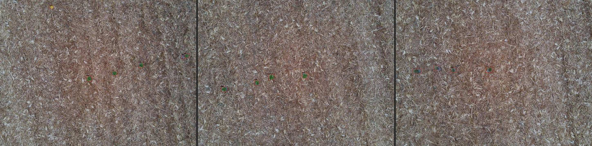
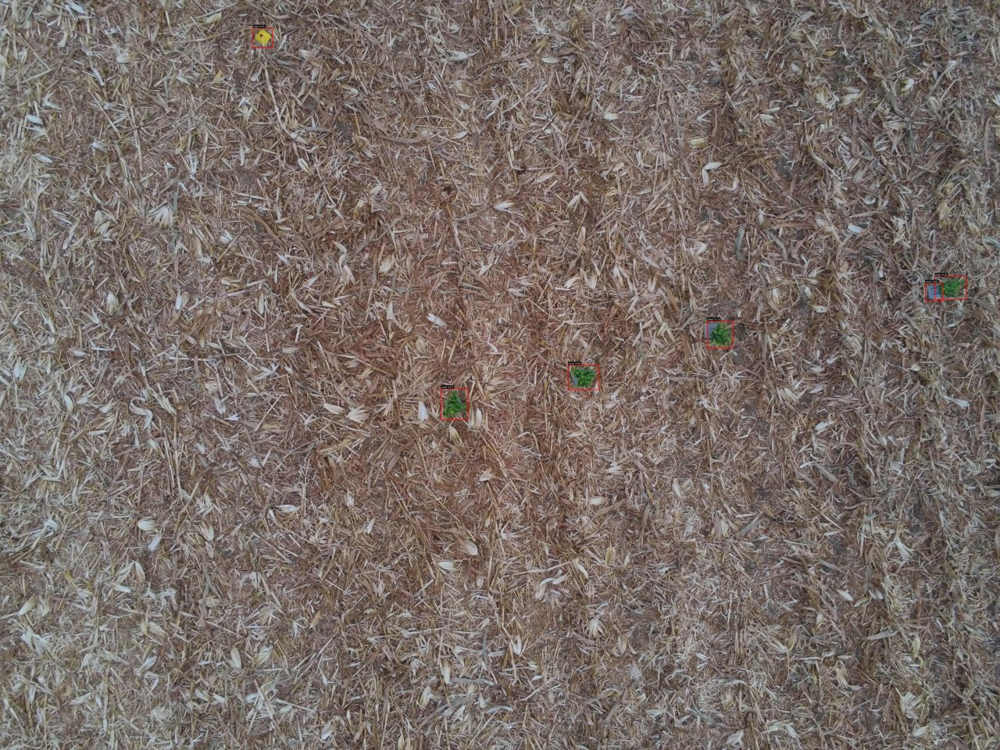
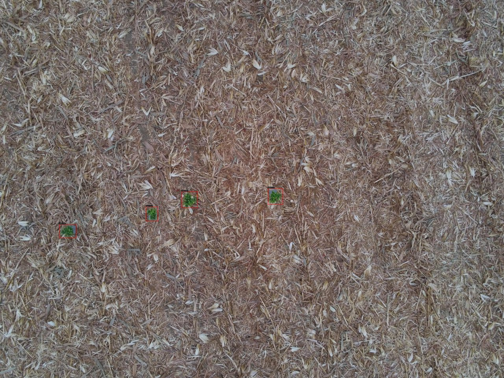
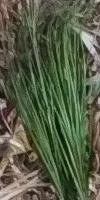
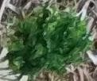

# OWLv2 + DINOv3 Open-Vocabulary Detection & Patch-Similarity Classification

This repository implements a two-stage **open-vocabulary computer vision pipeline** that combines:

1. **OWLv2** for open-vocabulary object detection using natural-language prompts  
2. **DINOv3** for patch-level self-supervised feature embeddings and zero-shot classification via similarity

The pipeline is designed for research workflows in **ecology, agriculture, plant monitoring, wildlife studies**, and any domain requiring *zero-shot, training-free* classification using only a few reference images.

---

## Demo results

OWLv2 detects plants in field imagery; DINOv3 patch similarity assigns each box to a reference class (`class1` / `class2`).



| Multi-object field result | Sparse seedlings on mulch |
|:---:|:---:|
|  |  |

| Reference `class1` | Reference `class2` |
|:---:|:---:|
|  |  |

More annotated samples: [`example/output/`](example/output/).

---

##  Key Features

- **Open-vocabulary OWLv2 detection** using flexible text prompts  
- **Zero-shot classification** from DINOv3 patch embeddings  
- **Two-stage vision pipeline** (Detection → Patch Similarity Classification)  
- **Batch processing** for high-throughput GPU inference  
- **Parallel classification** of detected objects  
- **Patch-level region similarity**, not just whole-image embeddings  
- **Automatic cropping and saving of detections**  
- **Rich JSON output + detailed logs + summary statistics**  
- Minimal setup — no training required  
- Ideal for research, benchmarking, rapid prototyping

---

##  Pipeline Overview
```
Input Images
│
▼
OWLv2 Open-Vocabulary Detection
│   (detection prompts: “a plant”, “vegetation”, …)
▼
Detections → NMS → Bounding Boxes
│
▼
Extract Patch Embeddings (DINOv3)
│
▼
Compare Region Patches Against Class Image Embeddings
│
▼
Select Most Similar Class (Zero-Shot Classification)
│
▼
Save Crops, Results JSON, Detailed Log, Stats
```
---

##  Repository Structure

```text
owlv2-dinov3-open-vocabulary-pipeline/
│
├── pipeline/
│   ├── __init__.py
│   ├── config.py            # central configuration
│   ├── detection.py         # OWLv2 detection module
│   ├── embeddings.py        # DINOv3 patch embedding extractor
│   ├── classification.py    # patch-level zero-shot classifier
│   ├── utils.py             # NMS, I/O, helper utilities
│
├── example/
│   ├── class_images/        # two class reference images
│   └── output/              # annotated demo results (boxes + labels)
│
├── docs/images/             # README visuals (collage + featured frames)
│
├── results/                 # auto-generated outputs (JSON, crops, logs)
│
├── run_pipeline.py          # main entrypoint script
├── requirements.txt
├── LICENSE
└── README.md

```
⸻

 Getting Started

1. Install Dependencies
```
pip install -r requirements.txt
```
You must have a GPU-compatible PyTorch installation if you wish to use CUDA.

2. Prepare Input Data

Class Images (Exactly Two Required)

Place two labeled reference images under:
```
examples/class_images/
    class1.jpg
    class2.jpg
```
The filenames (class1, class2) become your prediction labels.

Target Images

Put any number of test images here:
```
examples/test_images/
    img001.jpg
    img002.jpg
    ...
```


3. Run the Pipeline
```
python run_pipeline.py
```
The script will:

	•	Load OWLv2 and DINOv3
	•	Compute embeddings for the two class images
	•	Detect objects using OWLv2 prompts
	•	Run NMS
	•	Compute DINOv3 patch similarity
	•	Assign class labels
	•	Export JSON + crops + logs


### Outputs

After running the pipeline, all results are stored in:
```
results/

owlv2_dino_batch_results.json
```
Each detected object is represented as:
```
{
  "img": "image_01.jpg",
  "prediction": 1,
  "label": "class1",
  "latency": 42.7,
  "confidence": 0.93,
  "bounding_box": [x1, y1, x2, y2]
}
```

### Cropped Patches

Saved under:
```
results/cropped_patches/
```
Each crop corresponds to a detected object.

### Detailed Log

Human-readable log:
```
results/owlv2_dino_batch_detailed_log.txt
```
Includes:

	•	bounding box
	•	OWLv2 confidence
	•	DINOv3 similarity score
	•	predicted class
	•	per-object latency
	•	aggregated statistics


### Configuration

All hyperparameters, paths, and prompts are controlled in:
```
pipeline/config.py
```
Key parameters include:

Detection
```
DETECTION_PROMPTS = [["a photo of a plant", "vegetation", "foliage"]]
CONFIDENCE_THRESHOLD = 0.1
NMS_THRESHOLD = 0.5
```
Batching
```
BATCH_SIZE = 4
MAX_WORKERS = 4
```
Paths
```
CLASS_IMAGE_DIR
TARGET_IMAGE_DIR
OUTPUT_DIR
```
Device
```
DEVICE = "cuda" or "cpu"
```
Patch Size
```
PATCH_SIZE = 16
```

## How It Works (Technical Explanation)

### 1. OWLv2 (Google) — Open-Vocabulary Detection

OWLv2 accepts natural-language prompts such as:

["a plant", "vegetation", "foliage"]

It returns bounding boxes for any object matching the text, enabling detection in scenarios with:

	•	no labels
	•	no training
	•	unlimited classes


### 2. DINOv3 (Meta) — Patch-Level Embeddings

DINOv3 produces a grid of patch embeddings:
```
H/16 × W/16 patches
```
This allows localized similarity rather than whole-image embeddings.


### 3. Patch Similarity Classification

For each detection:

	1.	Extract patches inside the bounding box
	2.	Compare patch vectors with patch vectors from each class image
	3.	Compute cosine similarity
	4.	Pick the class with the highest max similarity

This produces a true zero-shot classifier requiring only 2 class images.


## Why This Matters (for Research & ML Engineering)

This project demonstrates:

	•	Multi-model CV system design
	•	Practical open-world vision workflows
	•	Patch-level representation learning
	•	Efficient parallelized GPU inference
	•	Real-world engineering practices:
	•	batching
	•	memory management
	•	JSON logging
	•	modular architecture

It is a strong portfolio example for ML/CV research engineer roles because it integrates detection + embeddings + similarity classification in a clean, reproducible, configurable pipeline.


### Citations


OWLv2
```
@misc{minderer2024scalingopenvocabularyobjectdetection,
      title={Scaling Open-Vocabulary Object Detection}, 
      author={Matthias Minderer and Alexey Gritsenko and Neil Houlsby},
      year={2024},
      eprint={2306.09683},
      archivePrefix={arXiv},
      primaryClass={cs.CV},
      url={https://arxiv.org/abs/2306.09683}, 
}
```
DINOv3
```
@misc{siméoni2025dinov3,
      title={DINOv3}, 
      author={Oriane Siméoni and Huy V. Vo and Maximilian Seitzer and Federico Baldassarre and Maxime Oquab and Cijo Jose and Vasil Khalidov and Marc Szafraniec and Seungeun Yi and Michaël Ramamonjisoa and Francisco Massa and Daniel Haziza and Luca Wehrstedt and Jianyuan Wang and Timothée Darcet and Théo Moutakanni and Leonel Sentana and Claire Roberts and Andrea Vedaldi and Jamie Tolan and John Brandt and Camille Couprie and Julien Mairal and Hervé Jégou and Patrick Labatut and Piotr Bojanowski},
      year={2025},
      eprint={2508.10104},
      archivePrefix={arXiv},
      primaryClass={cs.CV},
      url={https://arxiv.org/abs/2508.10104}, 
}
```

